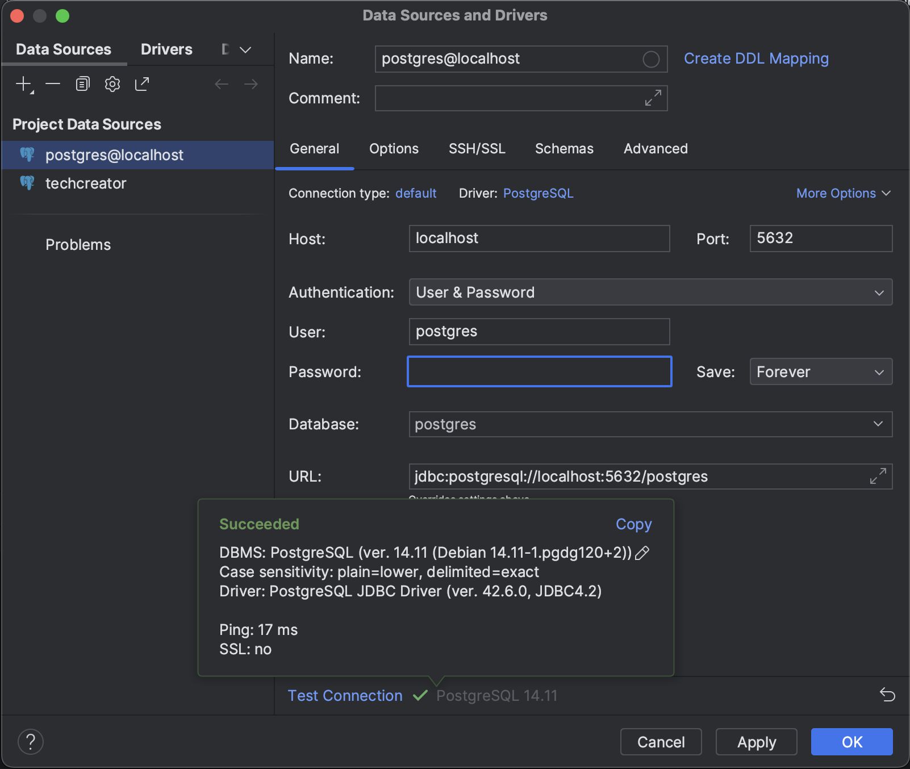

# Flink-Kafka-Postgres Pipeline

## :pushpin: Getting Started

Before starting, make sure to have Docker and Docker Compose installed:

  1. [Docker Desktop](https://docs.docker.com/get-docker/) (required)
  2. [Docker Compose](https://docs.docker.com/compose/install/#installation-scenarios) (required)


## :boom: Running the pipeline

**:warning: Before you get started, ensure that Docker Desktop is open and the Docker Daemon is running! :warning:**

### TL;DR

**Run the following commands to start the pipeline:**

  ```bash
  make restart
  make job

  # Or, you can manually execute:
  docker compose down --remove-orphans # same as `make down`
  docker compose --env-file .env up --build --remove-orphans -d # same as `make up`
  docker compose exec -d jobmanager ./bin/flink run -py /opt/src/job/start_job.py --pyFiles /opt/src # same as `make job`
  ```

The commands above will:

- **`make restart`**:
  - **`make down`**: Stop any running containers and remove them. This is to make sure you're starting from a clean environment.
  - **`make up`**: Create and start the Docker containers defined in the docker-compose.yml file. This includes spinning up a Postgres instance inside Docker, Apache Flink, and other services.
- **`make job`**: Deploy the Flink job defined in **`start_job.py`** to the Flink cluster.

**Now you should be able to see the job running in the Flink UI at [http://localhost:8081/](http://localhost:8081/).**

**In a separate terminal, connect to the PostgreSQL service using the PostgreSQL CLI:**

  ```bash
  make psql

  # Or, manually:
  docker exec -it pyflink-postgres psql -U postgres -d postgres -p 5632
  ```

Once connected, you can execute SQL queries, such as the example below:

  ```sql
  SELECT COUNT(*) FROM processed_events;
  ```

Here's a demonstration of how it works:

  ```bash
  psql (15.3 (Debian 15.3-1.pgdg110+1))
  Type "help" for help.

  postgres=# SELECT COUNT(*) FROM processed_events;
  count
  -------
  100
  (1 row)
  ```

> 
> *You may also attempt to connect to the PostgreSQL service using a database client such as DataGrip. However, please note that this method might not work due to system settings, network configuration or other factors. If you still wish to try, make sure PostgreSQL is installed on your local machine. Then, add a new database connection in your database client with the following details:*
> - Host: `localhost` or 127.0.0.1
> - Port: **`5632`** (**not** the default port 5432)
> - Database: `postgres`
> - User: `postgres`
> - Password: `postgres`
>
> *Here's a screenshot demonstrating how to add a new connection in DataGrip:*
> 
> 
>

## :broom: Clean up

**When you're done, make sure to terminate the running terminals, stop the running containers, and clean up any unused resources:**
    
```bash
make down

# Or:
docker compose down --remove-orphans
```

**If you want to cancel any running Flink jobs without stopping the Flink cluster, you can use the following command:**

```bash
make cancel
```

> *This command automatically retrieves and cancels all running Flink jobs. If you don't have Make, you can simply cancel the jobs in the Flink UI.*
>
> *While the manual approach is more cumbersome, if you're curious or want to learn the hard way anyway, the command to cancel a Flink job is:*
> 
> ```bash
> docker compose exec -d jobmanager ./bin/flink cancel <JOB_ID>
> ```
> 
> *Replace **`<JOB_ID>`** with the actual JobID of the job you want to cancel. You can obtain the JobID from the Flink UI, logs, or by running the command below:*
> 
> ```bash
> docker compose exec -d jobmanager ./bin/flink list -r
> ```
> 
> *Instead of a quick one-line command, this now becomes a multi-step process, which is why we recommend simply canceling the jobs in the UI, or using the **`make cancel`** command if you can. But we leave it up to you to decide what your heart desires!*


## :wrench: Troubleshooting tips

If you encounter any Docker or PostgreSQL issues, perform a complete cleanup and restart first to see if that fixes the problem. Follow these steps:

1. Delete the mounted **`postgres-data`** folder:

  ```bash
  rm -rf postgres-data
  ```

  >
  > :grey_exclamation: *Note that the **`/var/lib/postgresql/data`** directory inside the PostgreSQL container is mounted to the **`./postgres-data`** directory on your local machine. This ensures data persistence across container restarts or removals.*
  >
  > *Note that this also means if you don't delete the **`postgres-data`** folder, it will skip the initialization where it runs the DDLs in the **`data.dump`** file and instead use the data in the **`postgres-data`** folder.*
  > 


2. Ensure all running containers are stopped:

  ```bash
  docker compose down
  ```

3. Prune Docker to remove unnecessary resources. You will receive a prompt to confirm the cleanup. Proceed by typing **`y`** and pressing Enter.

  ```bash
  docker system prune

  WARNING! This will remove:
  - all stopped containers
  - all networks not used by at least one container
  - all dangling images
  - unused build cache

  Are you sure you want to continue? [y/N] y
  ```

4. Restart Docker Desktop, checking it is up to date.

5. Open a new terminal and retry.

6. Worst case scenario, repeat the above steps, restart your computer, and then try again.


:information_source: To see all the make commands that're available and what they do, run:

```bash
make help
```

### References
- https://nightlies.apache.org/flink/flink-docs-release-1.18/docs/deployment/resource-providers/standalone/docker
